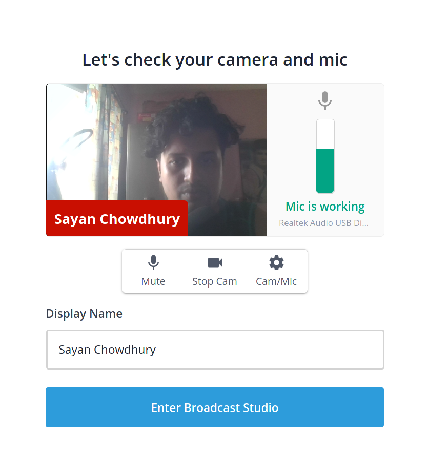
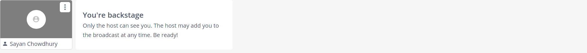
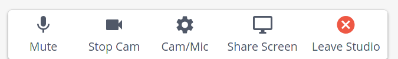
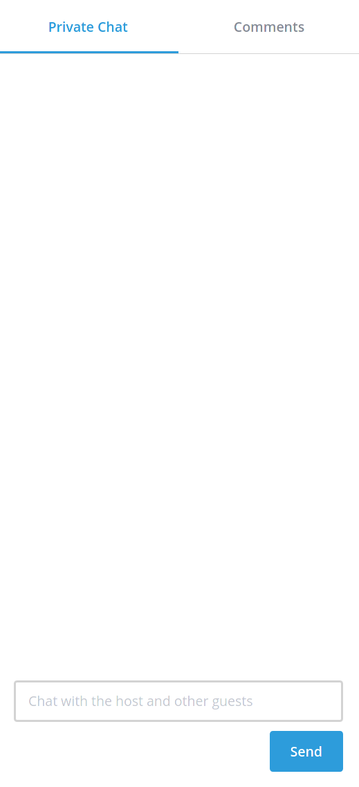
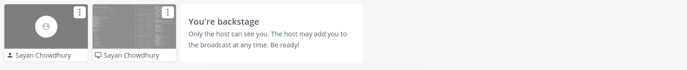

I am a speaker, help me setup!
==============================

First of all, thanks for submitting your talk for PyCon India 2020. We are
thrilled to have you as our speaker, and we are sure that the attendees can't wait to listen to your talk. Before that this year we would like to tell you something which you might already know, PyCon India 2020 is going online. This brings new changes and ways to host the conference.

So, please read through this document as will help the experience of
everyone in PyCon India an eventful one.

Platforms in PyCon India
------------------------

- **Hopin**: This is the event platform, where the attendees will the be attending the talks, workshops, keynotes, etc.
- **Zulip**: This is our official communication/Chat platform where you can interact with other attendees. *Volunteers will be contacting you using the same channel*. So make sure you are available on the platform during the conference. Please follow the link[1], to join the platform. It will automatically join you in the required streams (similar to channel in slack). Send a message on #2020/speaker-lounge channel once you are checked-in for the event.
- **Streamyard**: This platform is our Broadcast Studio i.e. all the speakers will be joining here to give the talk. The video stream from here will be relayed to Hopin platform. You need to be available 15 minutes before your talk slot on the url. Exact url will be provided by volunteer on #2020/speaker-lounge stream.

.. note:: Streamyard is the platform where the speakers will join to present the talk, and not Hopin.

Preparing for your talk
------------------------

Some things to consider in preparation for the conference. Please make sure that:

- You have gone through at least one call with our rehearsal team. This is not applicable if you are selected in the `.extend()` track
- Your talk details are displayed correctly on the website.
- You've your talk recorded and shared with our team in case of any mishappenings with network or bandwidth issues. The talks need to be presented live so that you can interact with the participants. However, we understand technological challenges that may arise due to unforeseen circumstances.
- You've checked your internet connection and are connected to at least a 1Mbps or more on upload/download speed.
- You're present on our official communication medium, `Zulip <https://pyconindia.zulipchat.com/>`_ and have joined the stream `#2020/speaker-lounge <https://pyconindia.zulipchat.com/#narrow/stream/258757-2020.2Fspeaker-lounge>`_.
- You've gone through the schedule on `Hopin` and made sure that your name and links are displayed properly. (If not, please feel free to reach out to us at support@in.pycon.org with your concern.)

.. note:: Talk recording is to be be shared if you are doubtful about setup. In case, you are confident that the setup would work, would can skip sending us the recording. In case of issues, we will have to drop the talk, as we cannot reschedule it.

On Conference Day
------------------

Some things to remember on the day you're having your session. Make sure that:

- You've logged in to `Streamyard` and checked your connection.
- You're device is powered up and have sufficient battery backup or is connected to a reliable power source. We would recommend that you're connected to a reliable power source and not be dependent solely on battery power.
- You've already shared your backup video with us.
- Your internet connection is functioning properly.
- You've turned off any background updates or notifications that might distract you from your talk.
- You've turned off your mobile notifications or have it in silent. (Phone rings during a talk can be extremely annoying).
- You've everything you need nearby, like a glass or bottle of water (or snacks in case you need).
- You've joined the appropriate stream on Zulip according to the stage your in. Please check which stage you're in (Bengaluru, Chennai, Hyderabad, Delhi or Pune).

During your talk
-----------------

Here are a few things for you to follow during your talk. Please make sure you've:

- Joined the Streamyard link shared by the stage moderator.
- Tested your video and screen with the moderator before your talk starts so that once we're live, the participants don't have to wait.
- You will have a total of 30 minutes for your talk. We suggest keeping the last 5 minutes for any Q/A. In case you would like to take Q/A offline, please make sure you have informed about your choice to the moderators.
- You will be given a warning as you approach closer to the end time. 1st warning at 5 mins to the end. 2nd warning at 2mins to the end. Your session will end at the end of 30 minutes. This will be strictly maintained so please make sure that you've concluded by then.
- The moderators will share the questions as given by the participants and you can take them accordingly.

Streamyard flow
---------------

Streamyard provides a `good video tutorial <https://youtu.be/An5ko-YEp1o?t=922>`_ on the same. Watch it before proceeding forward

- The moderator will share the link for your Broadcast studio on the Zulip channel, `#2020/speaker-lounge <https://pyconindia.zulipchat.com/#narrow/stream/258757-2020.2Fspeaker-lounge>`_.
- Once head over to the Streamyard, you will be seeing the screen shown below:

This screen is to test your video and microphone.

- After you enter the Broadcast studio, you will be placed in the Backstage which looks like this:

The moderator can selectively move or remove you from the screen. The first thing you can do after logging in is to drop a message to the moderator via Private Chat on the right.

- Once you enter the stream, you will see the toolbar (refer to the picture given below):

- The first button is "Mute" to control your microphone. Click it to enable and disable the microphone
- The second button is to control your video feed.
- The third button with a gear symbol is "Cam/Mic" to select the input/output of the video and the mic.
- The fourth button is the "Share Screen" button, which you will be using the share the presentation on the screen.
- The last button removes you out of the Studio.

.. note:: If you are planning to share your screen with **audio**, you will need to have same audio output and input sources, and use Google Chrome to join/share a tab with StreamYard.

- On the right-hand side you can see the Private Chat. When you are in backstage the **only way to interact with the moderator is to use private chat.**. As mentioned before,
  as soon as you enter the backstage, let the moderator know through the private chat.

- You will be entering the Streamyard platform 5-10 mins before your talk which means it possible that there will be an ongoing talk when you enter. As soon as the talk end, you can share your screen. Once you are sharing your screen, your shared screen would also be added into the backstage as shown in the image below:

Further Information
-------------------

Do let us know you want to get a trial of the platform before your talk. We will try to provide you with one.

Troubleshooting & Further Reading
---------------------------------

**Streamyard**:

- `Guest Instruction <https://streamyard.com/resources/docs/guest-instructions/>`_
- `Mac Camera Access <https://streamyard.com/resources/docs/mac-camera-access/>`_
- `Mac Catalina Screen Capture Permissions <https://streamyard.com/resources/docs/mac-catalina-screen-capture-permissions/>`_

This guide has been inspired by `EuroPython 2020 - Speaker Guide <https://docs.google.com/document/d/1hno9PgvEViHBkmCXP6BkpAsL8-mTpm6Sb8S6A8lwVPs/edit>`_.
